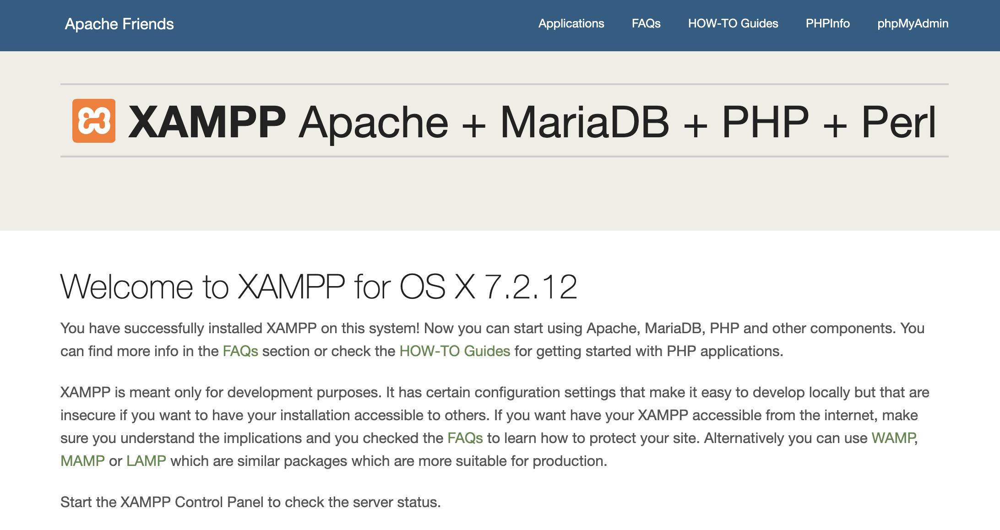

# books-manager-php
基于PHP+MySql实现的简单的图书管理系统
##### 一 XAMPP环境安装步骤
1. 配置xampp集成环境https://www.apachefriends.org/download.html，安装完成后，开启MySql和web服务，访问localhost即可打开页面；

2. 在集成环境中点击“Open Application Folder”找到对应的xamppfiles，htdos即为web静态资源根目录；
3. 下载yii2 basic，在htdos目录下新建mvc文件夹，将yii2解压至该目录；
4. 修改htdocs/mvc/basic/config/web.php文件，给`cookieValidationKey`配置项添加密钥（内容随意），否则yii无法运行；
5. 保证yii安装目录（basic文件及basic下的文件夹）的访问权限（可读可写）；
> ls -l    查看文件的具体信息  
> chmod -R 777 assets    修改assets文件及其自文件的的读写权限
6. 通过浏览器访问web路径`http://localhost/mvc/basic/web/index.php`即可看到主页面:  

##### 二 Yii环境基本配置
1. 配置数据库连接，修改config/db.php文件中的`dbname=yii2basic`，在xampp的phpmyadmin模块新建`yii2basic`数据库；
2. 激活Gii，在web.php文件中查看，确保存在如下片段：
```javascript
$config['bootstrap'][] = 'gii';
$config['modules']['gii'] = [
    'class' => 'yii\gii\Module',
    // uncomment the following to add your IP if you are not connecting from localhost.
    'allowedIPs' => ['127.0.0.1', '::1'],
];
```
检查应用入口脚本web/index.php，将YII_ENV设置为`dev`;  
3. 开发模式下，Gii模块已激活，可访问`http://localhost/mvc/basic/web/index.php?r=gii`进入Gii主页：

4. 在`yii2basic`数据库中新建图书基本字段表：

5. 在Gii中生成对应的`Model Generator`和`CRUD Generator`;
  


6. 至此，各环境基本配置完毕，可对controllers、models、views文件做进一步了解；   
7. 对应的模版目录:   
model: `/mvc/basic/vendor/yiisoft/yii2-gii/src/generators/model/default`;   
curd: `mvc/basic/vendor/yiisoft/yii2-gii/src/generators/crud/default`;
